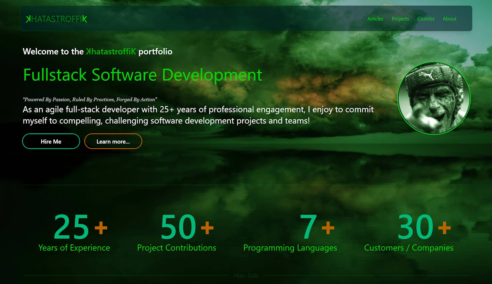

# Nuxtedo-Moon

**Nuxtedo-Moon** is a responsive _portfolio/blog static web page template_ designed using Nuxt, Nuxt-Content, Tailwind CSS and daisyUI.



<p align="center">

&nbsp;&nbsp;
&nbsp;&nbsp;
&nbsp;&nbsp;
</p>

<p align="center">

&nbsp;&nbsp;
&nbsp;&nbsp;
&nbsp;&nbsp;
</p>

## Demo

A regularly actualized **demo portfolio web page** is available here: [Demo](https://khatastroffik.github.io/nuxtedomoon/)

The deployment state is documented here: [Deployment Log](https://github.com/khatastroffik/nuxtedomoon/actions/workflows/deploy-nuxt-static-site.yml)

## Features Overview

This project is currently **work-in-progress**.
Feel free to have a look at the [project development board](https://github.com/users/khatastroffik/projects/4).

- [x] Generates a "_static_" site which is compatible with **GitHub-Page** and further "simple" server deployments
- [x] Responsive design!
- [x] Landing page to promote the "_portfolio_" (Hero, Stats... components)
- [x] Further Sections: _articles_ (blog), _projects_ (selection of achieved or wip projects and contributions), _crumbs_ (tipp'n tricks, small code pieces) and _about_ (profile, curriculum)
- [x] Customized (and easily adaptable) dark and light "_themes_" incl. toggle function
- [x] Prose adapted "_typography_" suitable for blog i.e. rich content rendering
- [x] "_breadcrumbs_" (incl. "_copy link to clipboard_" function) and "_prev/next page_" navigation
- [x] Automatic **SEO** (schema.org, og-images, robots.txt, link checker etc.) and ~100% lighthouse score
- [x] Fancy MDC (markdown components) &amp; web parts like _Quote-Of-The-Day_, _unscrambling_ text
- [x] Optimized image/media management using nuxt-image
- [ ] "_Table-of-Content_" on comprehensive pages
- [ ] Global "_text search_" functionality
- [ ] "_tags/topics_" assignment to specify the content of pages &amp; a corresponding "_filter_" functionality
- [ ] "_reading time_" for articles
- [ ] Integration of Nuxt-Studio to create and edit content files directly in the browser (while running the nuxt app in "_dev mode_", since the deployed page is static)
- [ ] Integration of "_JSON-resume_" (optional?) to provide rich data to the "_projects_" and "_about_" sections
- [ ] Simple configuration of portfolio and owner specific data
- [ ] ... more to come ...

## Nuxt Standard Information

### Installation

Make sure to install dependencies after cloning the original repository locally:

```bash
pnpm install
```

### Development Server

Start the development server on `http://localhost:3000`:

```bash
pnpm dev
```

### Production

Build the application for production:

```bash
pnpm build
```

Locally preview production build:

```bash
pnpm preview
```

## Sources &amp; Know-How

- Look at the [Nuxt documentation](https://nuxt.com/docs/getting-started/introduction) to learn more.
- Check out the [deployment documentation](https://nuxt.com/docs/getting-started/deployment) for more information.
